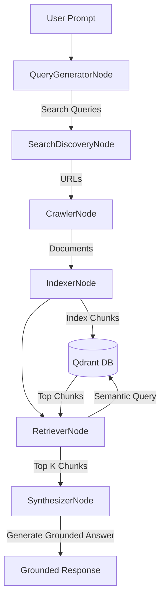
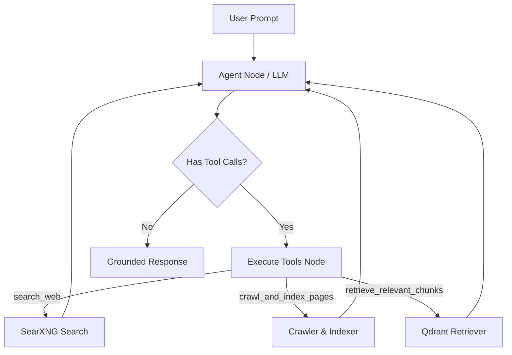

# SERP Agent & Search Engine

An autonomous search, crawl, index, and retrieval agent system built on top of FastAPI, LangGraph, Qdrant, and SearXNG. It supports both a deterministic sequential pipeline and a dynamic tool-calling ReAct agent loop.

---

## 🏗️ Architecture

The system supports two core graph execution modes:

### 1. Linear Mode (Deterministic Sequential Pipeline)
A fixed DAG execution flow optimized for speed, reliability, and deterministic crawling/retrieval.



### 2. ReAct Mode (Dynamic Agent Tool-Calling Loop)
A reasoning-based loop where the LLM dynamically chooses which search, crawl, or retrieve tools to call iteratively based on the prompt complexity.



---

## 🚀 Getting Started

### 1. Prerequisites
Ensure you have Python 3.11+, Docker, and Redis running.

```bash
# Start Redis container
docker run -d -p 6379:6379 --name redis-serp redis:7-alpine

# Install Playwright dependencies
playwright install chromium
```

### 2. Environment Configuration
Copy `.env.example` to `.env` and configure your API keys and local settings:
```env
LLM_PROVIDER=ollama
LLM_MODEL=qwen2.5:32b-instruct-q4_K_M
SEARXNG_BASE_URL=http://localhost:8080
REDIS_HOST=localhost
REDIS_PORT=6379
```

### 3. Run background worker & dev server
In separate terminals, run the tasks worker and dev api server:
```bash
# Start crawler task worker
uv run arq src.crawler.queue.redis_tasks.WorkerSettings

# Start the FastAPI dev server
uv run uvicorn src.serving.main:app --reload --port 8000
```

---

## 📡 API Usage & cURL Guides

The agent search endpoint is hosted at `/api/v1/agent/search`.

### 1. Linear Mode Request
Use this mode for quick, deterministic search pipelines.

```bash
curl -X POST http://localhost:8000/api/v1/agent/search \
  -H "Content-Type: application/json" \
  -d '{
    "prompt": "Apa saja manfaat kunyit untuk kesehatan?",
    "mode": "linear",
    "max_queries": 2,
    "num_results_per_query": 2
  }'
```

### 2. ReAct Mode Request (Conversational with Session Memory)
Use this mode for complex queries requiring multi-step reasoning. Pass a `thread_id` to maintain conversation thread memory.

```bash
curl -X POST http://localhost:8000/api/v1/agent/search \
  -H "Content-Type: application/json" \
  -d '{
    "prompt": "Bandingkan kandungan kurkumin pada kunyit and temulawak.",
    "mode": "react",
    "thread_id": "user-session-999"
  }'
```

### 3. Example JSON Response
Both modes return the same structured payload:

```json
{
  "prompt": "Apa saja manfaat kunyit untuk kesehatan?",
  "queries": [
    "manfaat kunyit untuk kesehatan",
    "kandungan senyawa aktif kunyit"
  ],
  "urls": [
    "https://example.com/kunyit-manfaat",
    "https://example.com/kunyit-senyawa"
  ],
  "indexed_count": 4,
  "answer": "Kunyit mengandung kurkumin [1] yang memiliki sifat anti-inflamasi dan antioksidan yang baik untuk tubuh."
}
```

---

## 🧪 Running Tests

Run the full pytest suite (fully mocked and offline-ready):

```bash
PYTHONPATH=. uv run pytest -o asyncio_mode=auto
```